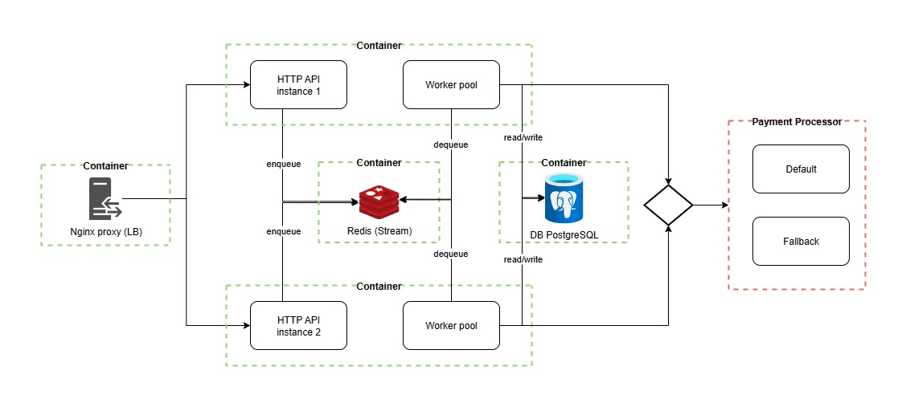

<h1 align="center">
  
   
 Rinha de backend 2025 : payment-proxy
</h1>

  🐹Golang | ⚙️ Redis Stream | 🐘 PostgreSQL | 🛡️ Echo Framework

##

## 🖧 Arquitetura

## ⚙️ Tecnologias Utilizadas

- **Linguagem**: Golang
- **Servidor HTTP**: [echo framework](https://github.com/labstack/echo)
- **Persistência**: Redis (Stream e cache)
- **Orquestração**: Docker + Docker Compose
- **Balanceamento**: NGINX
- **Database**: PostgreSQL

---

## ✅ Fluxo do Sistema

1. **Requisições HTTP** chegam ao NGINX, que distribui entre dois containers `api` em Go com `echo`.
2. O payload do pagamento é validado e enfileirado no Redis Stream.
3. Alguns **workers** consome o stream e processa os pagamentos.
4. O worker faz chamadas HTTP ao `payment processor` (default ou fallback), com seleção dinâmica baseada em healthcheck e latência.
5. O resultado é salvo no Database, e pode ser consultado via endpoint `/payments-summary`.

---

## 🚀 Estratégias de Desempenho

- **API com `echo`** para máxima performance.
- **Redis Stream** para enfileiramento dos pagamentos.
- **Paralelismo** via pool de workers.
- **Retry automático**: falhas no processamento são re-enfileiradas.
- **Locks com Redsync** para healthcheck distribuído e throttle de seleção de gateway.

---

## 📦 Endpoints

| Método | Rota                | Descrição                          |
|--------|---------------------|------------------------------------|
| POST   | `/payments`         | Cria um novo pagamento             |
| GET    | `/payments-summary` | Consulta totais por periodo        |
| POST   | `/purge-payments`   | Limpa o database                   |
